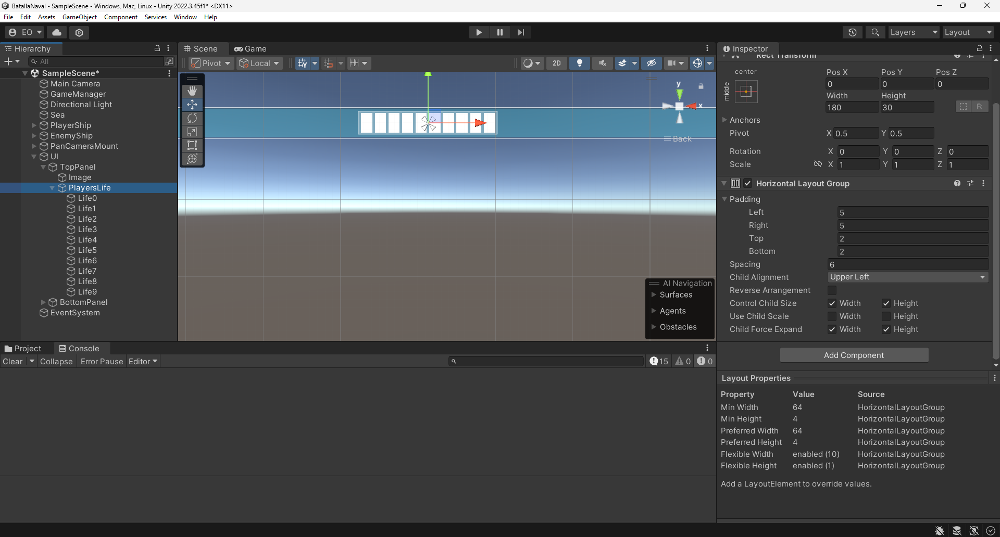
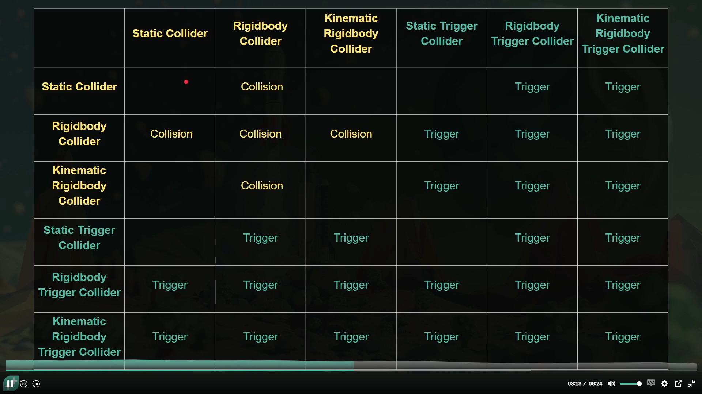

# Programacion

## Atajos
- Ctrl + F12 -- Rename all Ocurrences
- Ctrl + . -- Quick Fix (Encapsule method)
- Crear un singleton para acceder al Gamemanager directamente. Por ejemplo:
  Tengo un script UI colocado en un objeto UI, en el que se encuentra la jerarquia de toda mi interfaz.  Pues en ese script hago un singleton tal que:
  ~~~C#
  public class UI : Monobehaviour{
    public static UI instance;

    void Awake(){
        instance = this;
    }
  }
  ~~~

  De esta forma puedo llamar en otro script a esto directamente gracias al uso del singleton static. Solo deberia de haber un static por clase. Por ejemplo, el jugador puede tener un singleton porque solo deberia de haber uno. Si aparecen varios enemigos, se va a liar parda. Deberia de investigar mas sobre esto.

  - ? closes:
~~~C#
var mode = m_Network.IsHost ?
"host" : m_NetworkManager.IsServer ? "Server" : "Cliente"
~~~
es lo mismo que:
~~~C#
var mode;
if (m_Network.IsHost)
{
    mode = "host";
}
else if (m_NetworkManager.IsServer)
{
    mode = "Server";
}
else
{
    mode = "Cliente";
}
~~~

## Classes and Namespaces
- Encapsulated code. What the code can see, change or be changed by

## Methods
- Encapsulated code, member of a class and can be introduced with parametres

## Post Processing
- Volume component - Volumen en el que se va a aplicar el procesado

## Invoke 
- Call a method withing x seconds
~~~C#
Invoke("MethodName", delayInSeconds);
~~~

## Entrada
### Input Actions
- Parte del sistema de entrada moderno que reemplaza al sistema clásico (Input.GetKey, Input.GetButton, etc.)

- Podemos asignar distintos tipos de entrada y llamarlos en codigo para, por ejemplo, implentar movimiento

## Delegate
~~~C#
 public delegate PlayerBullet OnCannonShotDelegate(PlayerBullet bullet);
 public OnCannonShotDelegate onCannonShot;

     void Update()
    {
        if (Input.GetKeyDown(KeyCode.Space) && CanShoot())
        {
            Shoot();
            GameObject bullet = Instantiate (bulletPrefab, shotPoint.position, shotPoint.rotation);
            bulletPrefab.GetComponent<Rigidbody>().AddForce(bulletPrefab.transform.position * 600f, ForceMode.Impulse);
            //Invocamos el Delegate onCannonShot
            if(onCannonShot != null)
            {
                onCannonShot(bullet.GetComponent<PlayerBullet>());
            }
        }
    }
~~~
## OnGUI
### 1. Partimos de un elemento base "UI"
- Tiene un componente Rect Transform que nos va a valer para posicionar sus elementos hijos
  
### 2. Paneles
  - Objeto panel con una image como componente
  - Esa imagen es de forma predeterminada un background al que le podemos cambiar el rgba
  - Rect transfrom tiene puntos de anclaje que es el lugar del UI donde establecemos nuestro 0,0 para este componente
### 3. Textos
- Pues eso, textos. Qué te esperabas poner aquí, listo.
- Los scripts que usen textos como variables necesitan su propia libreria:
~~~C#
using TMPro;
public class EjemploTexto : Monobehaviour
{
    TMP_Text ejemploTexto;
    int score = 0;
}
~~~
- Posicionamiento, tamaño y diferentes opciones de formateado

### 4. Barrita improvisada
- Hacemos un empty y le añadimos un **Horizontal Layout Group**
- Rellenamos el Empty con el numero de imagenes que querramos
  
- Asegurarnos que en el componente los hijos se expandan y se realice un control del alto y ancho

- Gestionamos el color"a"miento de las barritas by script
# Mecanicas

## Movimiento:
1. Entrada por teclado:
    - (Input.GetAxis, Input.GetKey)
    - Definir previamente una variable como InputAction - Asignarla en el inspector y?
    ~~~C#
    [SerializeField] InputAction thrust;
    Rigidbody rb;
    
    
    private void OnEnable()
    {
        thrust.Enable();
    }

    private void Start()
    {
        rb = GetComponent<Rigidbody>();
    }

    private void FixedUpdate()
    {
        if(thrust.isPressed(true))
        {
            
           rb.AddRelativeForce();
        }
    }
    ~~~
2. Traslación (transform.Translate)
3. Físicas (Rigidbody.velocity, Rigidbody.AddForce)
4. Rotaciones : transform.Rotate(); EulerRotations;
5. Metodo de Vector3,moverse hacia un punto especifico: 
    MoveTowards(a,b,c)
        a = current, position de move from
        b = target, position to move towards
        c = maxDistanceDelta, distance to move each time
6. Usar un InputAction para asociar entradas
7. Pulsar una tecla. el .xKey hace referencia a que tecla
~~~C#
Keyboard.current.lKey.isPressed
Keyboard.current.lKey.wasPressedThisFrame
~~~
La 2ª entrada solo comprueba 1 vez
8. Oscilaciones:
~~~C#
    - factorMovimiento = Mathf.PingPong(Time.time * speed, 1f); 
    - Vector3.Lerp(posicionInicial, posicionFinal, factorMovimiento); 
~~~
    - Objeto se mueve de punto A a punto B de forma progresiva 
9. Limitaciones de movimiento
- Podemos usar Mathf.Clamp() para limitar una variable entre un valor maximo y otro minimo:
~~~C#

public void OnMove(InputValue value)
{
    movement = value.Get<Vector2>():
}
private void ClampedMovement()
{
    float xOffset = movement.x * speed * Time.deltaTime;
    float rawXPost = transform.localPosition.x + xOffset;
    float clampedXPos = Mathf.Clamp(rawXpos, -xClampRange, xClampRange);

    float yOffSet = movement.y * speed * Time.deltaTime;
    float rawYPost = transform.localPosition.y + yOffset;
    float clampedYPos = Matf.Clamp(rawYPost, -yClampRange, yClampRange);

    transform.localPosition = new Vector3(clampedXPos, transform.localPosition.y + yOffset, 0f);
}
~~~
10. Moverse hacia un punto
~~~C#
private void MoveToTarget(){
    Vector3 moveDirection = (target.position - transform.position);
    moveDirection.y = 0; //Evitar desplazamientos en vertical
    moveDirection = moveDirection.normalized;
    controller.Move(moveDirection * speed * Time.deltaTime);
}
~~~

11. Movimiento en una plataforma horizontal
    - Método de emparejamiento padre-hijo: En la plataforma colocamos un triggercollider que 
 ~~~ C#
void OnTriggerEnter (Collider other)
if (other.gameObject.tag == "Plataforma"){
transform.parent = other.transform;
}
~~~
## Salto:
### Salto con comprobacion de suelo
~~~ C#
// ESTO ES UN EJEMPLO EXTRAIDO SOLO CON LO RELACIONADO CON SALTAR.
public class MarioMovement : MonoBehaviour
{
    float jumpForce = 6.5f; // Fuerza a aplicar con el salto
    int movementDirection;  //Direccion en la que esta mirando 
    bool startingJump; //Comprueba si ha empezado el salto (Creo que relacionado con la animacion)
    void Start()
    {
        startingJump = false; // Esta quieto
        walking = false; // Esta quieto
    }

    void Update(){
        if( IsGrounded() ) {
            animator.SetBool("jumping", false); //Si esta en el suelo, animacion no de salto
            if(Input.GetKeyDown(KeyCode.Space)) { //Pulsamos la tecla Space
                rb.AddForce(Vector3.up * jumpForce, ForceMode2D.Impulse); //Le damos un impulso al rigidbody para que el calculo se realiza con las fisicas.
                startingJump = true; //Ha empezado a saltar
                animator.SetBool("jumping", true); //Animador para que salte
            }
        }
    }
    private bool IsGrounded() {
        //Si estamos iniciando el salto no se utiliza el raycast para detectar si Mario está en el suelo,
        //por definición Mario no está en el suelo
        if(startingJump) {
            return false;
        }
        Vector3 raycastOrigin = transform.position;
        raycastOrigin.y -= 0.44f;
        float raycastRange = 0.10f;
        RaycastHit2D hit;

        hit = Physics2D.Raycast(raycastOrigin, Vector2.down, raycastRange, groundDetectionLayerMask);

        if(hit.collider != null)  {
            //Debug.Log("[Mario] IsGrounded raycast hit: "+ hit.collider.gameObject.name);
            return true;
        }
        return false;
    }
}

~~~

## Colisiones:
### 1. Classic Collider:
- Tipos: Box, Sphere, Capsule
- OnCollisionEnter, OnTriggerEnter
- Filtros con máscaras
~~~ C#
// Collision y comprobacion de componente
private void OnCollisionEnter (Collision other)
Object object = other.collider.GetComponent<Object>();
if(object!=null){
    GameManager.instance.AddPoints(object.points)
}
~~~

### 2. Triggers
- Interaccionan sin bloquear movimiento
~~~ C#

private void OnTriggerEnter (Collider other)
Object object = other.collider.GetComponent<Object>();
if(object!=null){
    GameManager.instance.AddPoints(object.points)
}
~~~

### 3. Interacciones entre rigidbody y trigger

### 4. Particulas
- Sistemas de particulas
  ~~~ C#

    void OnParticleCollision(GameObject other) {
        Rigidbody body = other.GetComponent<Rigidbody>();
    
    }
~~~

## Cámara:
- Cinemachine: Tipo de camara inteligente preconfigurada 
  1. Ver al personaje a traves de objetos:
    - Hacer un raycast entre la camara y el pj
    - En caso de contacto guardar el objeto y reducir la transparencia. 
    - Para cambiarla podemos guardar una copia del material con el alpha reducida y cuando choque el raycast cambia el material. 
    - Controllando el espacio de la referencia (cuando este null o no) volvemos a dejar la
## Tags
Tras registrar una colision, buscamos un componente de ese objeto (other):
~~~C#
other.gameObject.tag == "Player";
~~~

## Audio
### 1. Reproduccion de clip por script
- Necesitamos una fuente (Audio Source) y un receptor (Audio Listener)
- Reproducir audio por codigo. AudioSource es el componente de Unity y AudioClip el propio archivo a reproducir 
~~~C#
[SerializedField] audioFile;
AudioSource audiosource;
audioSource.PlayOneShot(audioFile);
~~~
### 2. Lineas de dialogo
- Ejemplo de lineas de dialogo
~~~C#
using TMPro;
using UnityEngine;
public class LineasDialogo : MonoBehaviour
{
    [SerializeField] string[] lineasTexto; //Aqui escribimos las lineas que queramos como elementos diferentes.
    //Lo podemos hacer desde el inspector
    [SerializeField] TMP_Text texto;

    int lineaActual = 0;

    void SiguienteLinea()
    {
        lineaActual++;
        texto.text = lineasTexto[lineaActual];
    } 
}
~~~
## Animator
- Ventana Animation - Con FileAnimation (.anim) ya creado, seleccionamos los sprites que necesitemos y los vamos colocando en la timeline para hacer la animacion que necesitemos.
1. Creamos un Animator Controller y se lo asignamos al COMP Animator del objeto
2. Creamos un script para controlar las animaciones 
~~~C#
Animator animator;
SpriteRenderer sprite;
void Start() {
    animator = GetComponent<Animator>();
}

void Update() {
    float speed = Input.GetAxis("Vertical");
    animator.SetFloat("Speed", speed);
}

~~~

- Ventana Animator - Set as layer default state - para animacion base
- Añadimos transicciones, parametros y condiciones desde el propio entorno
- En el inspector, marcar Has Exit Time para que las animaciones tengan un fin
- Dependiendo de la animacion (2D) podemos usar la mitad de las direcciones girando los sprites - sprite.flipX = true|| sprite.flipY = true; 

~~~C#
SpriteRenderer sprite;
sprite.flipX = true;
sprite.flipY = true; 

~~~

## SerializeField 
- [SerializeField] Para permitir modificarlo desde la UI de Unity

## Components
~~~C#
GetComponent<>().material.color = Color.black;
~~~

## Relaciones entre componentes
- Podemos declarar en los scripts asociados a objetos variables para añadir relaciones con otros objetos

## Destroy Objects
- Destroy(gameObject);

## Frefabs
- Copias de un objeto como estancias
- Cambios sobre un prefab pueder overridear el resto de instancias que se encuentren en el estado puro de ese prefab

~~~C#
GameObject bulletPrefab;

if (Input.GetKeyDown(KeyCode.Space))
{
    GameObject bullet = Instatiate 
}
~~~

## Order of execution
- [UnityDOC](https://docs.unity3d.com/Manual/execution-order.html)

## Graphic Settings
- Project Settings --> Player --> Default Icon & Default Cursor

## Particles
- Añadir componente Particle System
- Uno de los submenus permite gestionar Collisions

## Scenes
 - File - BuildProfiles -> There we have a list(index) of the diff scenes 
 - Scene max value --> SceneManager.sceneCountInBuildSettings
o

SceneManager.LoadScene("SceneName");
## Build & Share
- File - Build Profiles - "Seleccionar la plataforma en la que exportar" - Build

## Interacciones
Edit>Project Settings> Input Manager 
~~~C
if (Input.GetButtonDown("Interaction"))
{
    Interaccion();
}
~~~

# Design Tips
 - Design "moments" and then expand them into a level. 

# Unity Modules
## Terrain
- Añadir elemento > Terrain
- Tiene una elementa de terreo con herramientas de esculpido, modificacion etc. Por ahora parece mas versatil el de blender a falta de tener en cuenta como realizar la importacion

## MasterLine
- Basicamente un timeline gigante para la escena.
- Funciona igual que animacion en 2D u otras timelines
- Podemos añadir objetos en la timeline directamente, hacer agrupaciones y gestionarlas de forma independiente.
- Hay un gestor de señales que permite la implementacion de métodos en la propia masterline

## LOD Group
- Son diferentes tipos de modelos para un mismo objeto que se renderizan dependiendo de la distancia de la cámara respecto de estos
- Ayudan a reducir drasticamente la carga grafica manteniendo la fidelidad de los objetos al acercarse

 

