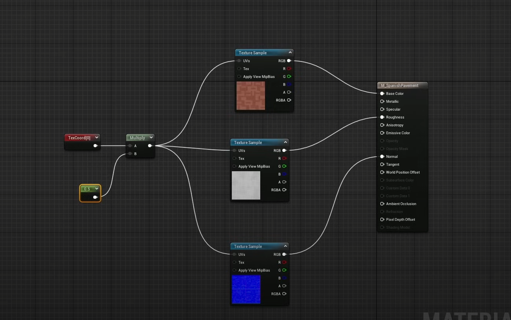

#  1. Cositas a tener en cuenta en Unreal
1. Force Compilation at Startup ✅
2. Content Drawer > Settings > Show Engine Content
3. Usar RD_ (raider) como IDE
4. A la hora de declarar variables tenemos que definir las propiedades de la variable
5. Las variables no primitivas necesitan tener asignados un puntero de memoria para el Garbage Collection
6. Probar Fast Script Reload para tiempos de carga

 # 2. Interfaz y shorcuts
- Con un objeto seleccionado, alt + raton para pivotar en el objeto
- Añadir objeto. Arriba a la izquierda "Cubo+"
- Arrastrar objetos sin mover la camara - Objeto seleccionado, shift + raton
- En la parte del arriba del viewport estan las opciones de snap. Tanto location como rotation
- Ctrl + L = Girar la posicion del sol
- En Gameplay mode, Shift+F1 para ver el raton
- 

# 3.Autoexposure 
- Aparentemente seteada por defecto. 
- Esta configurada en Outliner>Volumes>GlobalPostProcessvolume>Metering Mode
- Efectos globales: Caja de Volumen > Settings Infinite Extent (Unbound) ✅

# 4. Materials
- Crear nuevo material
- Sistema de materiales de nodos
- Importante compilar el material para ver los cambios. Apply button arriba a la izquierda
- ## Texturas
- Igual que blender, triple mapa:
  - 1. Textura
  - 2. Bump
  - 3. Normal 
 - Conectamos a sus respectivos.
  Podemos añadir un escalable Con un TextCoordinates y una constante conectados a un Multiply 

  ### Parametros
  Para evitar la compilacion del material cada vez que hagamos un cambio. Usamos parámetros.
  En el Material Graph cogemos los nodos que consideremos, click derecho y Convert to Parameter.
  Tenemos que hacer una estancia del **material**? e ir modificando desde esta los parametros.
  - Podemos hacer un Master Material e hijos que hereden.

# 5 Importing models
- En el tuto usa un .fbx. Investiga sobre esto

# 6 Nanite
- Sistema que permite realizar una carga progresiva de densidad de polígonos en relacion a la longitud de la camara. Usada principalmente en landscapes.

# 7 Blueprints
1. Comprobar funcionamiento de nodos: **Select Debug mode** Arriba a la derecha de la top bar. Seleccionamos el objeto cuyos nodos queremos debugear.
2. 

# 8 Classes
1. Si